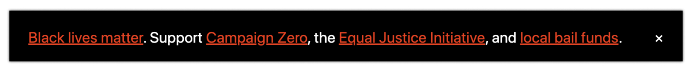
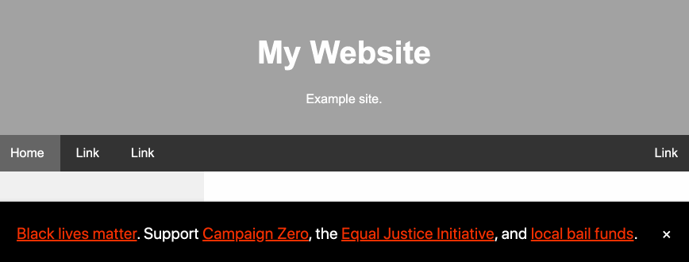

# blm.js

A quick script that can included on any page to make the site grayscale and add a support footer for Black Lives Matter and related causes.



[Demo website](https://rawcdn.githack.com/freedmand/blm.js/a84ae044421c0ded97091b945e68e5b34e9441e5/example.html)



## Usage

Simply copy the following script tag and paste on any website before the closing `</head>` tag:

```html
<script src="https://cdn.jsdelivr.net/gh/freedmand/blm.js/blm.js">
```

For instance, if your site looks like this:

```html
<!DOCTYPE html>
<html lang="en">
<head>
  ...
</head>
<body>
  ...
</body>
</html>
```

You can include the blm.js here:

```html
<!DOCTYPE html>
<html lang="en">
<head>
  ...
  <script src="https://cdn.jsdelivr.net/gh/freedmand/blm.js/dist/blm.js">
</head>
<body>
  ...
</body>
</html>
```

It will also work if you include it in the `<body>`, though it is not preferable.

## Credit

The <a href="https://svelte.dev">Svelte</a> JavaScript framework made their website grayscale and included a support footer, as documented in this <a href="https://twitter.com/sveltejs/status/1267824283763400707">tweet</a>.

This library is a clone of that idea that makes it easy to include similar such messages on other sites.

## License

[MIT](https://opensource.org/licenses/MIT)
